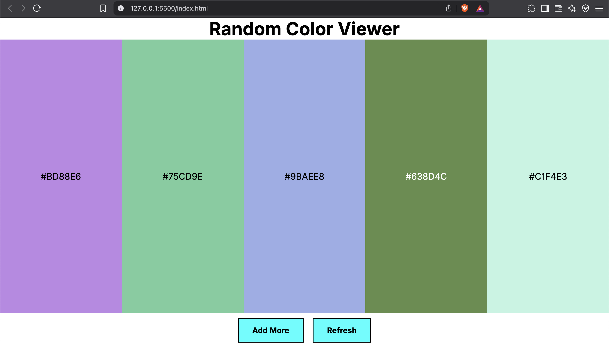

# 🎨 Random Color Viewer

### 🌐 Live Demo: [👉 View it here](https://random-color-viewer.netlify.app/)  

A simple and responsive web app that generates random color palettes. It displays 5 random colors on load, allows users to add up to 10 colors, and lets you refresh the palette anytime.

 
---

## 🚀 Features

- 🎲 Generates random HEX color codes
- ➕ Add more colors (up to a limit of 10)
- 🔄 Refresh button resets the palette with new colors
- 🌓 Automatically adjusts text color for readability (based on brightness)
- 📱 Fully responsive layout for desktop and mobile

---

## 🛠️ Tech Stack

- HTML5
- CSS3 (Responsive design)
- JavaScript (DOM manipulation)

---

## 📂 Project Structure

```plaintext
/project-folder
├── index.html # Main HTML file
├── styles.css # CSS styles
├── script.js # JavaScript logic
├── screenshot.png # App screenshot
└── README.md # Project overview
```
---


## 📄 License

This project is open source and free to use.

---

## 🙌 Author

Made by Manohar Reddy Baddam  
Feel free to connect with me on [LinkedIn](https://www.linkedin.com/in/manohar-reddy-baddam/) or check out my [GitHub](https://github.com/manoharbaddam)
